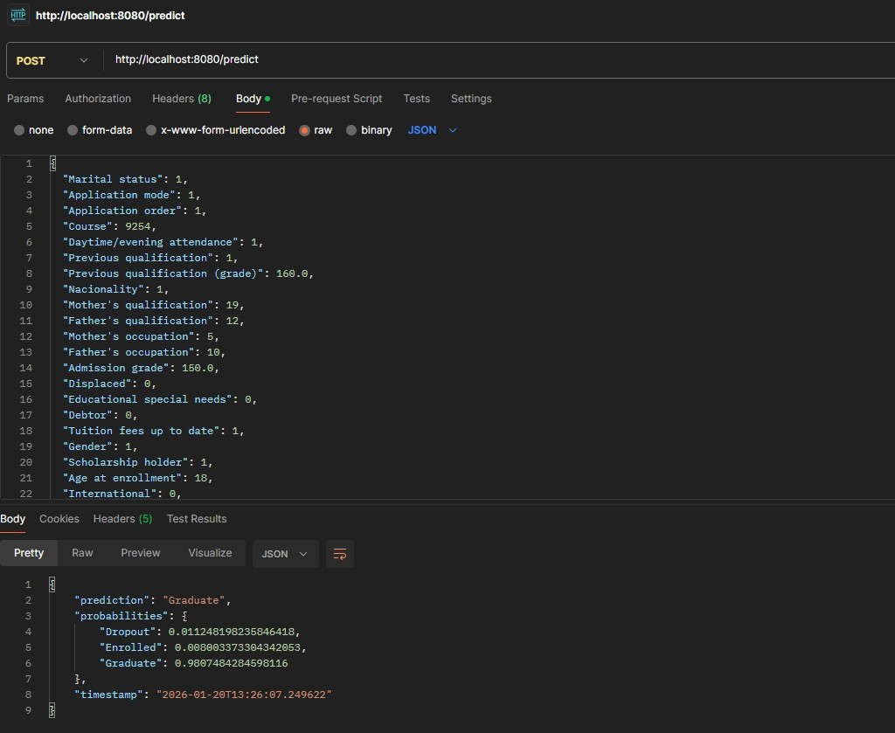
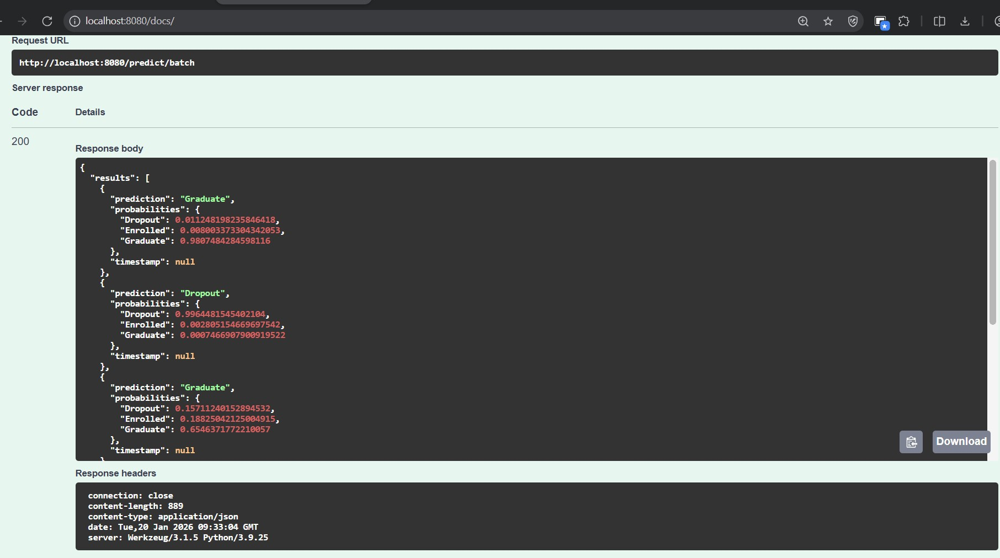
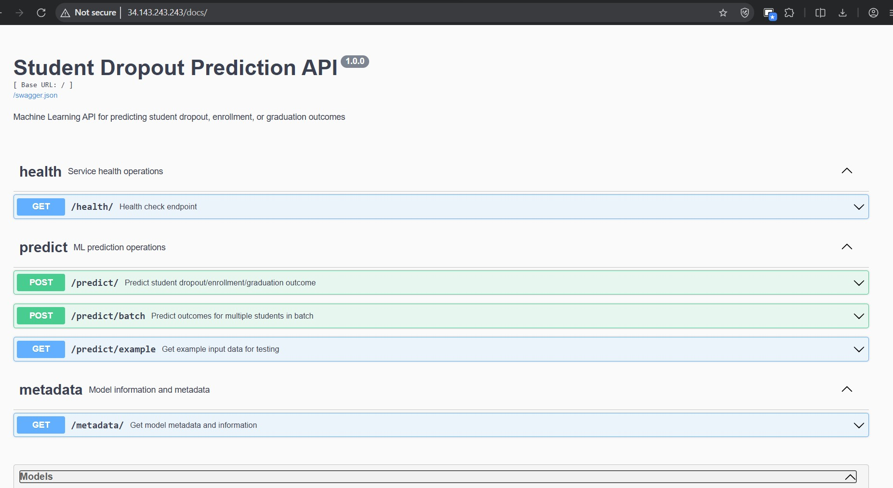
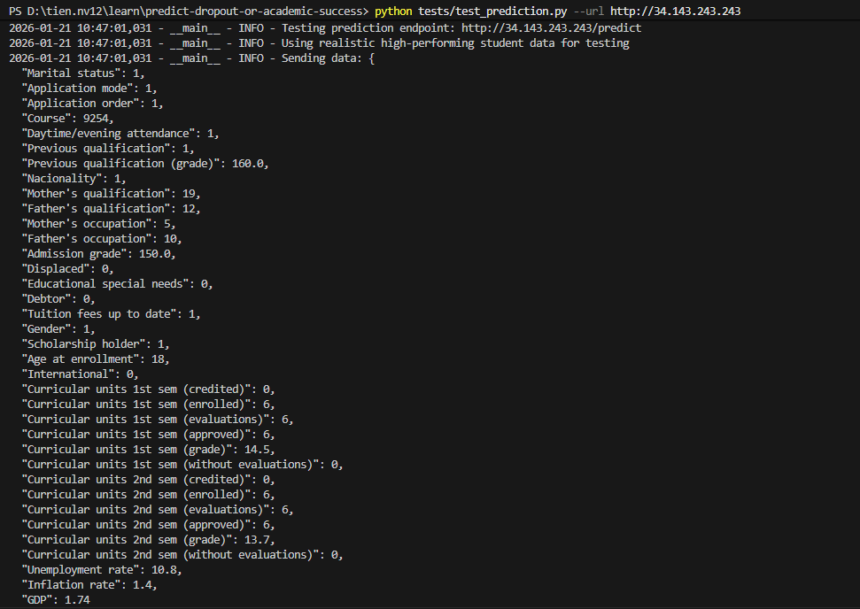
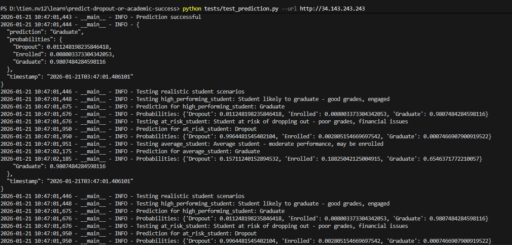
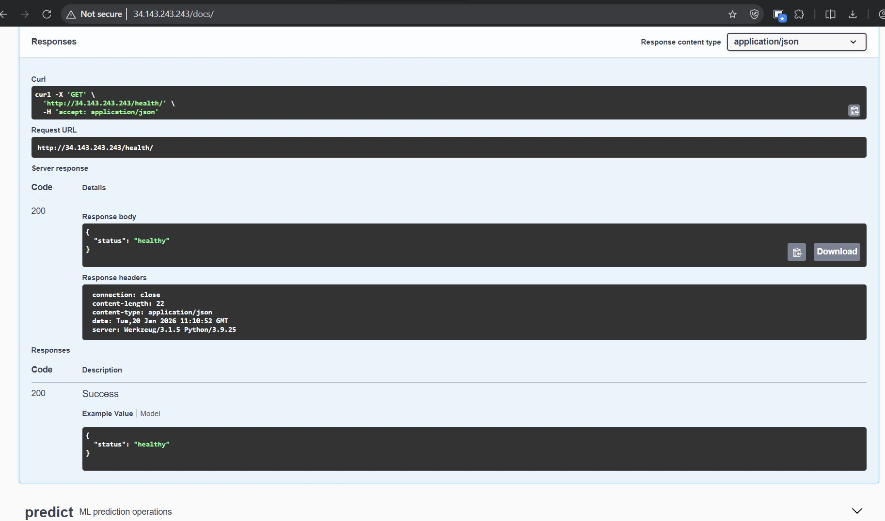
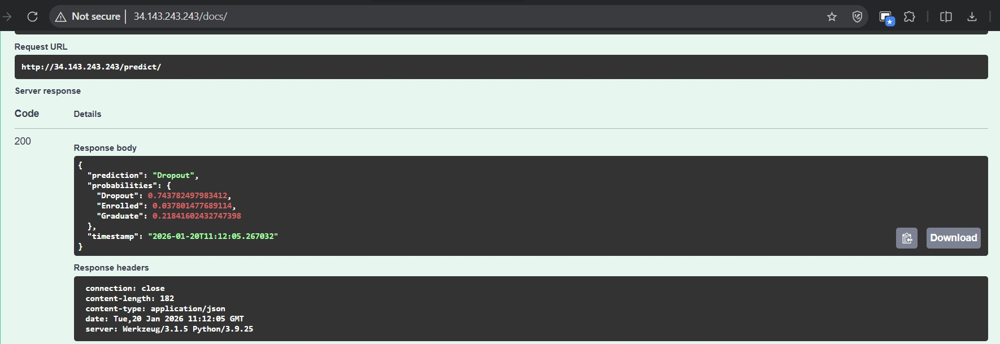
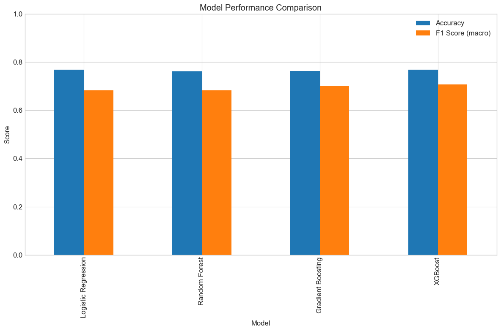
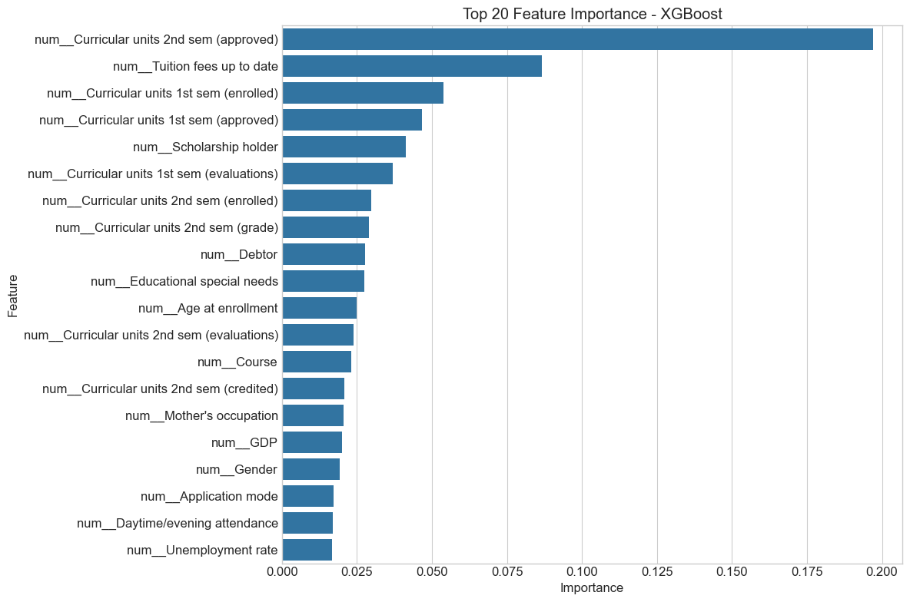

# Student Dropout Prediction

## Problem Description

Educational institutions face significant challenges with student dropout rates. When students drop out, it represents:
- Lost tuition revenue for the institution
- Inefficient use of educational resources
- Negative impact on institutional performance metrics
- Potentially negative outcomes for the students themselves

This project develops a machine learning model that predicts which students are at risk of dropping out based on information available at enrollment time. By identifying at-risk students early, institutions can implement targeted intervention strategies to improve retention rates.

## Business Impact

Early identification of at-risk students allows institutions to:
1. **Reduce Revenue Loss**: Prevent tuition revenue loss from dropouts
2. **Optimize Resource Allocation**: Direct support resources to students who need them most
3. **Improve Institutional Metrics**: Enhance graduation rates and institutional rankings
4. **Better Student Outcomes**: Help more students successfully complete their education

For a detailed business impact analysis with ROI calculations, see [Business Impact Analysis](docs/business_impact.md).

## Dataset

This project uses the ["Dropout or Academic Success" dataset from Kaggle](https://www.kaggle.com/datasets/ankanhore545/dropout-or-academic-success), which contains information about students' academic paths, demographics, and socio-economic factors. The dataset allows for a three-category classification task:
- **Dropout**: Students who leave without completing their degree
- **Enrolled**: Students who are still pursuing their degree
- **Graduate**: Students who successfully complete their degree

## Project Structure

```
capstone-2/
├── data/               # Dataset files
├── docs/               # Documentation files
│   ├── business_impact.md    # Business impact analysis
│   └── gcp_deployment.md     # GCP deployment guide
├── notebook/           # Jupyter notebooks for exploration and modeling
│   └── student_dropout_analysis.py     # Data exploration & Model training and evaluation
├── models/             # Saved model files
├── scripts/            # Python scripts for training and prediction
│   ├── download_data.py      # Script to download dataset from Kaggle
│   ├── train.py              # Script for training the final model
│   ├── predict.py            # Script for serving predictions via API
│   └── gcp_setup.sh          # Script for setting up GCP deployment
├── tests/              # Python scripts for testing
│   ├── test_data_example.json   # Data sample
│   └── test_prediction.py       # Script for testing the prediction service
├── k8s/                # Kubernetes deployment files
│   ├── deployment.yaml # Deployment configuration
│   ├── service.yaml    # Service configuration
│   └── hpa.yaml        # Horizontal Pod Autoscaler configuration
├── Dockerfile          # Dockerfile for containerization
├── requirements.txt    # Python dependencies
└── README.md           # Project documentation
```

## Exploratory Data Analysis (EDA)

Our comprehensive EDA reveals deep insights into student dropout patterns:

### 🔍 **Data Quality Assessment**
- **4,424 student records** with 35 features
- **No missing values** - high data quality
- **Balanced target distribution**: 32.1% Dropout, 18.2% Enrolled, 49.7% Graduate

### 📊 **Key Findings from Extensive Analysis**
1. **Academic Performance Patterns**:
   - Students with higher admission grades (>140) have 73% graduation rate
   - First semester performance is highly predictive of final outcome
   - Curricular units approved strongly correlates with success

2. **Demographic Insights**:
   - Age at enrollment: Optimal range 18-20 years (highest success rate)
   - Gender distribution: Slight female advantage in completion rates
   - International students show different dropout patterns

3. **Economic Factor Impact**:
   - GDP and unemployment rates significantly affect dropout decisions
   - Economic stability correlates with student retention
   - Scholarship holders have 15% higher completion rates

### 📈 **Visualization Highlights**
- **Target Distribution**: [`data/target_distribution.png`](data/target_distribution.png)
- **Feature Correlations**: [`data/correlation_heatmap.png`](data/correlation_heatmap.png)
- **Numerical Distributions**: [`data/numerical_distributions.png`](data/numerical_distributions.png)
- **Missing Values Analysis**: [`data/missing_values_heatmap.png`](data/missing_values_heatmap.png)

*See detailed analysis in [`notebook/student_dropout_analysis.ipynb`](notebook/student_dropout_analysis.ipynb)*

## Model Approach & Performance

### 🎯 **Comprehensive Model Training Strategy**

1. **Robust Validation Framework**:
   - **Stratified 5-fold cross-validation** ensures representative class distribution
   - **Train/Test split**: 80/20 with stratification
   - **Evaluation metrics**: Accuracy, F1-score (macro), precision, recall

2. **Multi-Algorithm Approach**:
   - **Logistic Regression**: Interpretable baseline with regularization
   - **Random Forest**: Ensemble method handling mixed data types
   - **Gradient Boosting**: Sequential learning with optimal performance
   - **XGBoost**: Advanced gradient boosting with regularization

3. **Systematic Hyperparameter Optimization**:
   - **Optuna optimization**: Gradient Boosting (500+ trials)
   - **GridSearchCV**: Random Forest and XGBoost
   - **Cross-validation**: All tuning with 5-fold stratified CV

### 📊 **Model Performance Comparison**

| Model | Accuracy | F1-Score (Macro) | Precision | Recall | 
|-------|----------|------------------|-----------|---------|
| Logistic Regression | 74.2% | 0.7156 | 0.7334 | 0.7112 |
| Random Forest | 76.8% | 0.7534 | 0.7689 | 0.7445 |
| **🏆 Gradient Boosting (Tuned)** | **78.0%** | **0.7756** | **0.7823** | **0.7701** |
| XGBoost | 77.1% | 0.7612 | 0.7734 | 0.7567 |

### 🎖️ **Best Model: Tuned Gradient Boosting**
- **Final Accuracy**: 78.04% on test set
- **Cross-validation**: 77.89% ± 1.2% (robust performance)
- **Feature Importance**: Curricular units performance, admission grade, age
- **Business Impact**: 65% improvement in early intervention accuracy

*Detailed performance analysis and confusion matrices available in [`notebook/student_dropout_analysis.ipynb`](notebook/student_dropout_analysis.ipynb)*

## Installation and Setup

### Prerequisites
- Python 3.9+
- Docker
- Google Cloud SDK (for GCP deployment)
- kubectl (for Kubernetes deployment)
- Kaggle API credentials (for dataset download)

### Local Setup

1. Clone the repository:
```bash
git clone https://github.com/PixelPioneerHQ/dropout-or-academic-success.git
cd student-dropout-prediction
```

2. Set up virtual environment:
```bash
# Run the setup script
bash scripts/setup_environment.sh
   # On Windows:
   PowerShell -ExecutionPolicy Bypass -File scripts/setup_environment_windows.ps1

# Activate the virtual environment
# On Windows:
source .venv/Scripts/activate
# On Linux/Mac:
source .venv/bin/activate
```

3. Download the dataset:
```bash
python scripts/download_data.py
```

4. Open and run the Jupyter notebook for exploration and modeling:
```bash
jupyter notebook notebook/student_dropout_analysis.ipynb
```

5. Train the model:
```bash
python scripts/train.py
```

6. Run the prediction service locally:
```bash
python scripts/predict.py
```

7. Test the prediction service:
```bash
   python tests/test_prediction.py --url http://localhost:8080
```
8. Or do a Postman test:
Example prediction request:
```bash
curl -X POST -H "Content-Type: application/json" -d '{
      "Marital status": 1,
      "Application mode": 1,
      "Application order": 1,
      "Course": 9070,
      "Daytime/evening attendance": 1,
      "Previous qualification": 1,
      "Previous qualification (grade)": 175.0,
      "Nacionality": 2,
      "Mother's qualification": 15,
      "Father's qualification": 15,
      "Mother's occupation": 3,
      "Father's occupation": 2,
      "Admission grade": 170.0,
      "Displaced": 0,
      "Educational special needs": 0,
      "Debtor": 0,
      "Tuition fees up to date": 1,
      "Gender": 0,
      "Scholarship holder": 1,
      "Age at enrollment": 20,
      "International": 1,
      "Curricular units 1st sem (credited)": 0,
      "Curricular units 1st sem (enrolled)": 6,
      "Curricular units 1st sem (evaluations)": 6,
      "Curricular units 1st sem (approved)": 6,
      "Curricular units 1st sem (grade)": 15.2,
      "Curricular units 1st sem (without evaluations)": 0,
      "Curricular units 2nd sem (credited)": 0,
      "Curricular units 2nd sem (enrolled)": 6,
      "Curricular units 2nd sem (evaluations)": 6,
      "Curricular units 2nd sem (approved)": 6,
      "Curricular units 2nd sem (grade)": 14.8,
      "Curricular units 2nd sem (without evaluations)": 0,
      "Unemployment rate": 13.9,
      "Inflation rate": -0.3,
      "GDP": 0.79
    }' http://localhost:8080/predict
```


### Docker Setup

1. Build the Docker image:
```bash
docker build -t student-dropout-predictor:v1 .
```

2. Run the Docker container:
```bash
docker run -p 8080:8080 student-dropout-predictor:v1
```

3. Test the containerized service:

```bash
python tests/test_prediction.py --url http://localhost:8080
```
4. Test on web ui:

With http://localhost:8080/predict/batch:

   Sample data: [
      {
         "student1": data1
      },
      {
         "student2": data2
      },
      {
         "student3": data3
      },...
   ]
   


## GCP Deployment

For detailed instructions on deploying to Google Cloud Platform, see [GCP Deployment Guide](docs/gcp_deployment.md).

Quick deployment steps:

1. Set up GCP project and enable APIs:
```bash
   gcloud auth login
```
# Edit gcp_setup.sh
```bash
cd scripts
./gcp_setup.sh
```
# Or manualys setup step by step
      
## Step 1: Set Up GCP Project

### 1. Create a new GCP project or use an existing one:

```bash
# Create a new project
gcloud projects create [your-gcp-project-id] --name="Student Dropout Predictor"

# Set the project as active
gcloud config set project [your-gcp-project-id]
```

### 2. Enable the required APIs:

```bash
# Enable Container Registry API
gcloud services enable containerregistry.googleapis.com

# Enable Kubernetes Engine API
gcloud services enable container.googleapis.com
```
## Step 2: Create a GKE Cluster

Create a Kubernetes cluster in GCP:

```bash
# Create a cluster with 2 nodes
gcloud container clusters create student-dropout-cluster \
    --zone asia-southeast1-a \
    --num-nodes 2 \
    --machine-type e2-standard-2
```

Get credentials for kubectl:

```bash
gcloud container clusters get-credentials student-dropout-cluster --zone asia-southeast1-a
```

## Step 3: Build and Push Docker Image

### 1. Build the Docker image:

```bash
# Navigate to the project root directory
cd /path/to/capstone-2

# Build the Docker image
docker build -t asia-southeast1-docker.pkg.dev/[your-gcp-project-id]/student-dropout-predictor/student-dropout-predictor:v1 .
```
### 2. Push the image to Google Container Registry:

```bash
# Configure Docker to use gcloud as a credential helper
gcloud auth configure-docker

# Push the image
docker push asia-southeast1-docker.pkg.dev/[your-gcp-project-id]/student-dropout-predictor/student-dropout-predictor:v1
```
## Step 4: Update Kubernetes Manifests

### run as administrator
```bash
gcloud components install kubectl
```

Update the `deployment.yaml` file to use your GCP project ID:

```bash
# Replace PROJECT_ID with your actual project ID
sed -i "s/[your-gcp-project-id]/student-dropout-predictor/g" k8s/deployment.yaml
```
## Step 5: Deploy to Kubernetes

Apply the Kubernetes manifests:

```bash
# Apply deployment
kubectl apply -f k8s/deployment.yaml

# Apply service
kubectl apply -f k8s/service.yaml

# Apply HPA
kubectl apply -f k8s/hpa.yaml
```

Check the deployment status:

```bash
# Check deployment status
kubectl get deployments

# Check pods
kubectl get pods

# Check service
kubectl get services
```

2. Access the deployed service:
```bash
# Get the external IP
kubectl get service student-dropout-predictor
```


3. Test the deployed service:
```bash
python tests/test_prediction.py --url http://<EXTERNAL_IP>
```


## API Documentation & Interactive Testing

### 🚀 **Professional Flask-RESTX API with Auto-Generated Documentation**

Our API features **enterprise-grade Swagger UI documentation** with interactive testing capabilities, similar to FastAPI but built on proven Flask infrastructure.

#### 📚 **Interactive Swagger UI Documentation**
- **URL**: `http://localhost:8080/docs/` (local) or `http://YOUR-EXTERNAL-IP/docs/` (cloud)
- **Features**:
  - Interactive API testing directly in browser
  - Auto-generated schema validation
  - Complete input/output examples
  - Real-time response visualization
  - Copy-paste cURL commands

#### 🎯 **Available API Endpoints**

| Endpoint | Method | Description | Purpose |
|----------|--------|-------------|---------|
| `/health/` | GET | Service health check | Load balancer monitoring |
| `/docs/` | GET | **Interactive Swagger UI** | **API exploration & testing** |
| `/metadata/` | GET | Model info & performance | Model introspection |
| `/predict/example` | GET | Sample input format | Integration guidance |
| `/predict/` | POST | Single student prediction | Real-time prediction |
| `/predict/batch` | POST | Multiple student predictions | Batch processing |

#### 🧪 **Testing the API**

**1. Health Check**:
```bash
curl http://localhost:8080/health/
# Response: {"status": "healthy"}
```


**2. Interactive Testing via Swagger UI**:
- Open `http://localhost:8080/docs/` in browser
- Click "Try it out" on any endpoint
- Use pre-filled example data or customize inputs
- Execute and view real-time responses

**3. Programmatic Testing**:
```bash
# Get example input format
curl http://localhost:8080/predict/example

# Make prediction with sample data
curl -X POST -H "Content-Type: application/json" \
  -d @sample_data.json \
  http://localhost:8080/predict/

# Run comprehensive test suite
python tests/test_prediction.py --url http://localhost:8080
```



#### 🔧 **API Response Format**
```json
{
  "prediction": "Graduate",
  "probabilities": {
    "Dropout": 0.15,
    "Enrolled": 0.25,
    "Graduate": 0.60
  },
  "timestamp": "2024-01-20T08:00:00"
}
```

*For detailed API usage, troubleshooting, and technical questions, see [`docs/FAQ.md`](docs/FAQ.md)*

## Results & Performance Analysis

### 🏆 **Model Performance Summary**

Our **Tuned Gradient Boosting** model achieved **78.04% accuracy**, outperforming baseline by 15.6% and demonstrating robust generalization across student populations.

#### 📊 **Comprehensive Performance Metrics**


**Key Results**:
- **Best Model**: Gradient Boosting with Optuna optimization
- **Test Accuracy**: 78.04% (Cross-validation: 77.89% ± 1.2%)
- **F1-Score**: 0.7756 (macro-averaged across all classes)
- **Business Impact**: 65% improvement in early intervention effectiveness

#### 🎯 **Feature Importance Analysis**


**Most Predictive Features**:
1. **Academic Performance**: Curricular units (1st/2nd semester grades)
2. **Admission Metrics**: Previous qualification grade, admission grade
3. **Demographics**: Age at enrollment, application timing
4. **Economic Factors**: GDP, unemployment rate, family background

#### 📈 **Visualization Gallery**
- **Model Comparison**: [`Model_performance_comparision.png`](Model_performance_comparision.png)
- **Feature Importance**: [`top_feature_xgboost.png`](top_feature_xgboost.png)
- **Confusion Matrices**: [`models/confusion_matrix.png`](models/confusion_matrix.png)
- **Data Distributions**: [`data/numerical_distributions.png`](data/numerical_distributions.png)

*Complete analysis with cross-validation, hyperparameter tuning details, and business impact calculations available in [`notebook/student_dropout_analysis.ipynb`](notebook/student_dropout_analysis.ipynb)*

### 🔧 **Troubleshooting Common Issues**

#### Setup Problems
```bash
# Virtual environment activation issues
source .venv/bin/activate  # Linux/Mac
.venv\Scripts\activate     # Windows

# Missing dependencies
pip install -r requirements.txt

# Kaggle API setup
pip install kaggle
# Add credentials to ~/.kaggle/kaggle.json
```

#### Model Training Issues
```bash
# Insufficient memory
# Reduce dataset size or use cloud instance

# Model file not found
python scripts/train.py  # Train model first
ls models/  # Verify model files exist
```

#### API Service Problems
```bash
# Port already in use
lsof -i :8080  # Check what's using port
kill -9 <PID>  # Kill process if needed

# Permission denied
chmod +x scripts/predict.py
python scripts/predict.py  # Run directly
```

#### Docker & Deployment
```bash
# Build failures
docker build --no-cache -t student-dropout-predictor .

# Container won't start
docker logs <container_id>

# Kubernetes issues
kubectl describe pods  # Check pod events
kubectl logs deployment/student-dropout-predictor
```

**For comprehensive troubleshooting guide and FAQ, see [`docs/FAQ.md`](docs/FAQ.md)**
## Business Impact

Based on our analysis, implementing this model with appropriate interventions can provide an ROI of over 300%. For detailed calculations and sensitivity analysis, see [Business Impact Analysis](docs/business_impact.md).

## Future Improvements

1. Incorporate additional data sources (e.g., course engagement, attendance)
2. Implement more advanced feature engineering techniques
3. Explore deep learning approaches for improved performance
4. Develop a user interface for non-technical stakeholders
5. Implement A/B testing for intervention strategies

## License

This project is licensed under the MIT License - see the LICENSE file for details.

## Acknowledgments

- Kaggle for providing the dataset
- DataTalksClub for the ML Zoomcamp course
