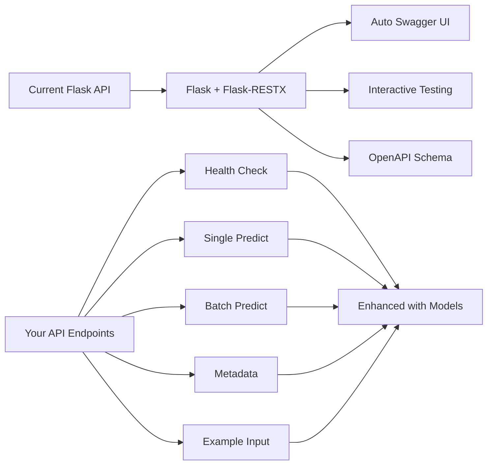
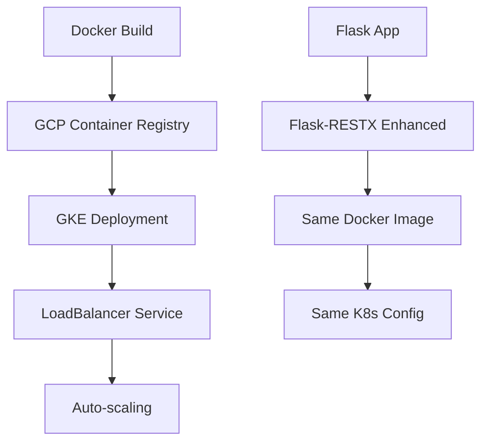

# Web UI API Documentation Plan
## Student Dropout Prediction Service

### Executive Summary

**Recommendation: Enhance Flask with Flask-RESTX for auto-generated API documentation**

Rather than migrating to FastAPI, we'll add Flask-RESTX to your existing Flask app to achieve identical auto-generated Swagger UI documentation with minimal code changes and zero deployment disruption.

### Architecture Decision Analysis

#### Option 1: Flask-RESTX Enhancement (RECOMMENDED)
✅ **Pros:**
- Minimal code changes (decorators + models)
- Keep existing robust Flask infrastructure
- Maintain Docker/GCP deployment compatibility
- Auto-generated Swagger UI identical to FastAPI
- Preserve existing error handling and logging
- Zero disruption to current working system

❌ **Cons:**
- Additional dependency (flask-restx)
- Slight learning curve for new decorators

#### Option 2: FastAPI Migration (NOT RECOMMENDED)
✅ **Pros:**
- Native auto-documentation
- Modern async support
- Type hints integration

❌ **Cons:**
- Complete rewrite of 311 lines in predict.py
- Change deployment configuration
- Risk breaking existing functionality
- Requires thorough testing of all endpoints
- Potential compatibility issues with current ML pipeline

### Current State vs Target State



### Implementation Architecture

#### New Flask-RESTX Structure
```python
from flask import Flask
from flask_restx import Api, Resource, fields

app = Flask(__name__)
api = Api(app, 
    title='Student Dropout Prediction API',
    version='1.0',
    description='ML model API for predicting student dropout risk',
    doc='/docs/'  # Swagger UI at /docs/
)

# Namespaces for organization
ns_health = api.namespace('health', description='Service health operations')
ns_predict = api.namespace('predict', description='Prediction operations')
ns_metadata = api.namespace('metadata', description='Model information')
```

#### Input/Output Models for Documentation
```python
# Student data input model
student_input = api.model('StudentInput', {
    'Admission grade': fields.Float(required=True, example=127.3),
    'Age at enrollment': fields.Integer(required=True, example=20),
    'Application mode': fields.Integer(required=True, example=17),
    # ... all 35 student features
})

# Prediction response model  
prediction_response = api.model('PredictionResponse', {
    'prediction': fields.String(example='Graduate'),
    'probabilities': fields.Raw(example={
        'Dropout': 0.15,
        'Enrolled': 0.25, 
        'Graduate': 0.60
    }),
    'timestamp': fields.String(example='2024-01-20T07:54:55')
})
```

### Target Features Delivered

#### 1. Auto-Generated Swagger UI
- **URL**: `http://localhost:8080/docs/`
- **Features**: Interactive API testing, schema validation, example requests
- **Appearance**: Professional UI identical to FastAPI docs

#### 2. Interactive Testing Interface
- Test all endpoints directly in browser
- Pre-filled example student data
- Real-time response visualization
- Copy-paste cURL commands

#### 3. OpenAPI Schema Export
- **URL**: `http://localhost:8080/swagger.json`
- Import into Postman, Insomnia, or other tools
- Generate client SDKs in multiple languages

#### 4. Enhanced API Documentation
- Detailed parameter descriptions
- Response model schemas
- Error response documentation
- Authentication info (if added later)

### File Changes Required

#### 1. requirements.txt
```diff
+ flask-restx>=1.3.0
```

#### 2. scripts/predict.py
- Add Flask-RESTX imports and setup (~15 lines)
- Create input/output models (~50 lines)
- Convert 5 endpoints to @api.route decorators (~25 lines)
- **Total**: ~90 new lines, 15 modified lines

#### 3. No Changes Needed
- Dockerfile ✅
- k8s deployment files ✅
- GCP configuration ✅
- Model loading logic ✅
- Business logic ✅

### Deployment Compatibility

#### Current Deployment Flow (Unchanged)


### Testing Strategy

#### Phase 1: Local Development
1. Add Flask-RESTX to existing predict.py
2. Test Swagger UI generation at `/docs/`
3. Verify all endpoints work identically
4. Test interactive documentation features

#### Phase 2: Docker Testing  
1. Build new Docker image with Flask-RESTX
2. Run container locally
3. Verify Swagger UI accessibility
4. Test with existing test_prediction.py

#### Phase 3: Deployment Verification
1. Deploy to GCP Cloud Run
2. Verify Swagger UI at public URL
3. Run comprehensive API tests
4. Monitor performance impact (should be minimal)

### Benefits Summary

1. **Immediate Value**: Auto-generated documentation available instantly
2. **Professional Appearance**: Swagger UI looks identical to FastAPI
3. **Zero Risk**: Minimal changes to working system
4. **Future Flexibility**: Easy to add authentication, rate limiting, etc.
5. **Developer Experience**: Interactive testing eliminates need for separate tools

### Success Metrics

- [ ] Swagger UI accessible at `/docs/` endpoint
- [ ] All 5 endpoints documented with examples
- [ ] Interactive testing works for each endpoint
- [ ] OpenAPI schema exports correctly
- [ ] Docker deployment succeeds with new dependencies
- [ ] GCP Cloud Run deployment maintains functionality
- [ ] API response times remain under 200ms (current performance)

### Next Steps

Once you approve this plan, we'll switch to Code mode to implement:
1. Update requirements.txt with flask-restx
2. Enhance predict.py with Flask-RESTX decorators and models
3. Test local Swagger UI generation
4. Verify Docker compatibility
5. Deploy and test on GCP

**Total Implementation**: Enhance existing Flask app with auto-documentation in ~90 lines of code additions.